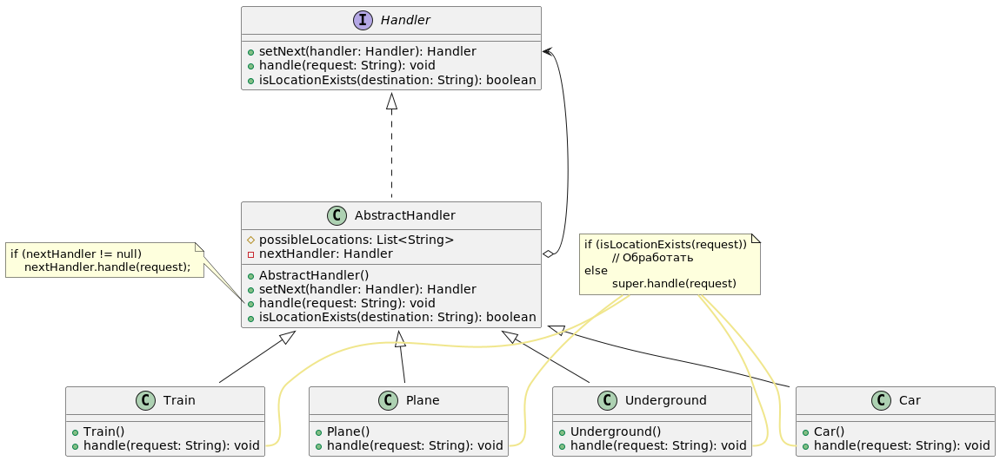

# Паттерн цепочка обязанностей (Chain of responsibility)

Цепочка обязанностей – поведенческий паттерн, позволяющий передавать запрос по цепочке потенциальных обработчиков, пока один из них не обработает запрос. Избавляет от жёсткой привязки отправителя запроса к его получателю, позволяя выстраивать цепь из различных обработчиков динамически.

1. Обработчик Handler определяет общий для всех конкретных обработчиков интерфейс. Обычно достаточно описать единственный метод обработки запросов, но иногда здесь может быть объявлен и метод выставления следующего обработчика.
2. Базовый обработчик AbstractHandler – позволяет избавиться от дублирования одного и того же кода во всех конкретных обработчиках. Этот класс имеет поле для хранения ссылки на следующий обработчик в цепочке. Клиент связывает обработчики в цепь, подавая ссылку на следующий обработчик через конструктор или сеттер поля. Также здесь реализован базовый метод обработки, который перенаправляет запрос следующему обработчику, проверив его наличие.
3. Конкретные обработчики (Car, Train и т.д.) содержат код обработки запросов. При получении запроса каждый обработчик решает, может ли он обработать запрос, а также стоит ли передать его следующему объекту.
4. Клиент может либо сформировать цепочку обработчиков единожды, либо перестраивать её динамически, в зависимости от логики программы. Клиент может отправлять запросы любому из объектов цепочки, не обязательно первому из них.