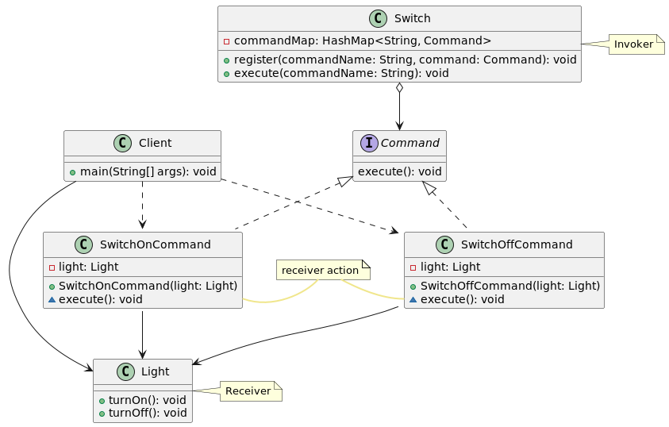

# Паттерн команда (Command)
Поведенческий паттерн Command преобразовывает запрос на выполнение действия в отдельный объект-команду. Такая инкапсуляция позволяет передавать эти действия другим функциям и объектам в качестве параметра, приказывая им выполнить запрошенную операцию. Команда – это объект, поэтому над ней допустимы любые операции, что и над объектом.

Интерфейс командного объекта Command имеет единственный метод execute(). Производные классы определяют получателя запроса (указатель на объект-получатель) и необходимую для выполнения операцию (метод этого объекта). Метод execute() подклассов Command просто вызывает нужную операцию получателя.

В паттерне Command может быть до трех участников:
* Клиент, создающий экземпляр командного объекта.
* Инициатор запроса (invoker), использующий командный объект.
* Получатель запроса (receiver).
 
Паттерн Command отделяет объект, инициирующий операцию, от объекта, который знает, как ее выполнить. Единственное, что должен знать инициатор, это как отправить команду. Это придает системе гибкость: позволяет осуществлять динамическую замену команд, использовать сложные составные команды, осуществлять отмену операций.