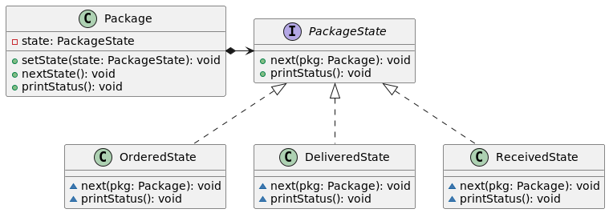

# Паттерн состояние (State)

Состояние (State) – поведенческий шаблон проектирования. Используется в тех случаях, когда во время выполнения программы объект должен менять своё поведение в зависимости от своего состояния. Паттерн State является объектно-ориентированной реализацией конечного автомата.

Поведение объекта зависит от его состояния и должно изменяться во время выполнения программы. Такую схему можно реализовать, применив множество условных операторов: на основе анализа текущего состояния объекта предпринимаются определенные действия. Однако при большом числе состояний условные операторы будут разбросаны по всему коду, и такую программу будет трудно поддерживать.

Паттерн State решает указанную проблему следующим образом:
* Вводит класс Context (в примере это Package), в котором определяется интерфейс для внешнего мира.
* Вводит абстрактный класс State (в примере – PackageState).
* Представляет различные "состояния" конечного автомата в виде подклассов State (OrderedState … ReceivedState).
* В классе Context имеется указатель на текущее состояние, который изменяется при изменении состояния конечного автомата.

Паттерн State не определяет, где именно определяется условие перехода в новое состояние. Существует два варианта: класс Context или подклассы State. Преимущество последнего варианта заключается в простоте добавления новых производных классов. Недостаток заключается в том, что каждый подкласс State для осуществления перехода в новое состояние должен знать о своих соседях, что вводит зависимости между подклассами.