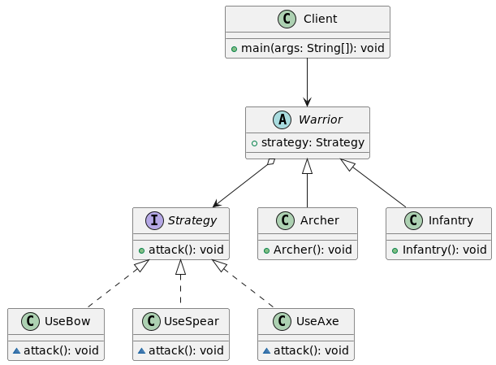

# Паттерн стратегия (Strategy)
Паттерн Стратегия относится к поведенческим шаблонам проектирования. Его задача – выделить схожие алгоритмы, решающие конкретную задачу. Реализация алгоритмов выносится в отдельные классы и предоставляется возможность выбирать алгоритмы решения задачи во время выполнения программы.

Разберем паттерн на примере военной стратегии. Имеется абстрактный класс контекста Warrior и интерфейс стратегии Strategy, при реализации которого в конкретных наследниках метод «атаковать» будет зависеть от вида оружия. Таким образом создается семейство алгоритмов (стратегий), которые остается подставлять в конструкторы игровых персонажей. Кроме этого, мы могли бы усовершенствовать наш код и менять стратегии атаки персонажей, например, при ближнем и дальнем бое (в примере для краткости это не было реализовано, отнесем к TODO).