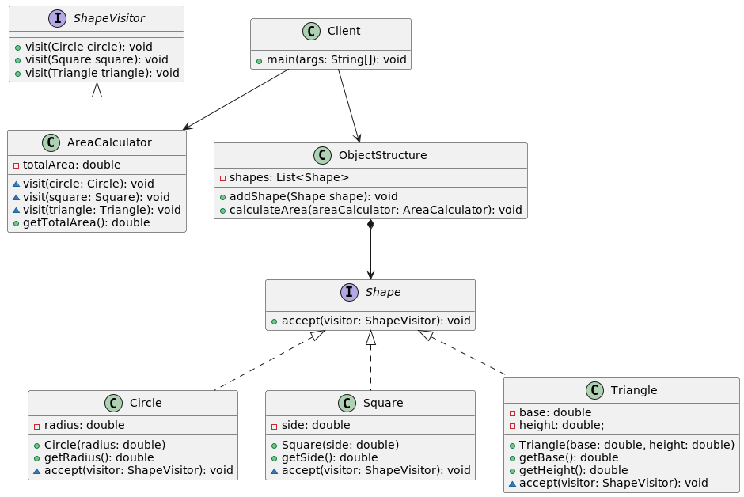

# Паттерн наблюдатель (Visitor)

Наблюдатель – это поведенческий паттерн проектирования, который позволяет отделить алгоритмы от объектов, с которыми они работают. Этот шаблон используется, когда требуется добавить новые операции в структуру объекта, не изменяя сам объект. Используя этот шаблон, можно создавать более гибкий и удобный для сопровождения код, который легче модифицировать и расширять.

Пример использования шаблона проектирования Visitor.
Имеется набор различных фигур, таких как круги, квадраты и треугольники.
Нам требуется вычислить площадь каждой фигуры,
но при этом классы самих фигур не будут подвергаться изменениям.  
* В интерфейсе ShapeVisitor определяются методы для вычисления площади каждого типа фигуры.
* AreaCalculator - конкретная реализация Visitor'а.
* ObjectStructure - класс для операций над группой фигур, содержит набор фигур в виде списка. Метод calculateArea вычисляет общую площадь всех фигур, вызывая в цикле метод accept для каждой из них, передавая AreaCalculator в Visitor.