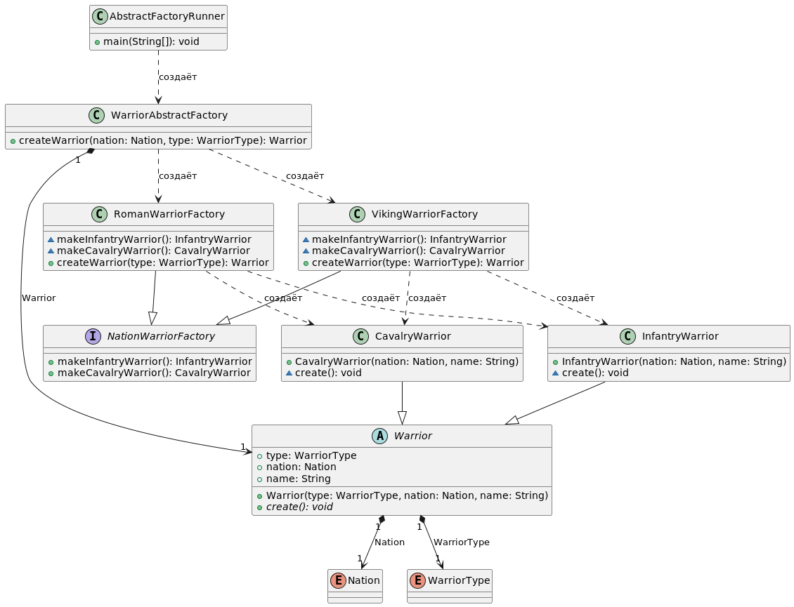

# Паттерн абстрактная фабрика (Abstract Factory)
Абстрактная фабрика, как и все фабричные паттерны, помогает правильно организовать создание новых объектов. С ее помощью можно управлять «выпуском» различных семейств взаимосвязанных объектов. Фактически ‒ это «фабрика фабрик».

Предположим, мы разрабатываем игру-стратегию, и в ней есть несколько боевых единиц. Есть несколько различных противоборствующих сторон. У разных сторон боевые единицы могут существенно различаться внешне. Пехотинцы, всадники и лучники римской армии ‒ не то же самое, что пехотинцы, всадники и лучники викингов. В рамках приложения, солдаты разных армий ‒ это различные семейства взаимосвязанных объектов. Абстрактная фабрика предоставляет интерфейс создания всех имеющихся продуктов (объектов семейства). У абстрактной фабрики, как правило, есть несколько реализаций. Каждая из них отвечает за создание одной из вариаций продукта. Абстрактная фабрика создает абстрактных воинов. Конкретные реализации этой фабрики создают, допустим, римских кавалеристов и пеших викингов.

Абстракция ‒ важнейший принцип данного паттерна. Клиенты фабрики работают с ней и с продуктами только через абстрактные интерфейсы. Поэтому можно не задумываться о том, каких воинов мы сейчас создаем, а передать эту обязанность какой-нибудь конкретной реализации абстрактной фабрики. 