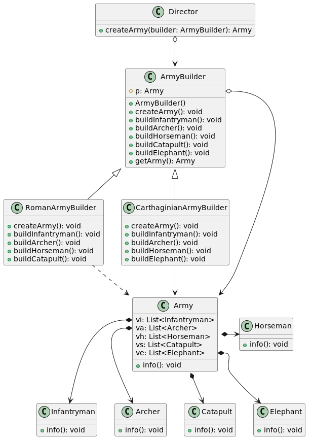

# Паттерн строитель (Builder)
Порождающий паттерн Строитель отделяет алгоритм поэтапного конструирования сложного продукта (объекта) от его внешнего представления так, что с помощью одного и того же алгоритма можно получать разные представления этого продукта.

Для этого паттерн Builder определяет алгоритм поэтапного создания продукта в специальном классе Director (распорядитель), а ответственность за координацию процесса сборки отдельных частей продукта возлагает на иерархию классов Builder. В этой иерархии базовый класс Builder объявляет интерфейсы для построения отдельных частей продукта, а соответствующие подклассы ConcreteBuilder их реализуют подходящим образом.

Паттерн Builder может помочь в решении следующих задач:
* В системе могут существовать сложные объекты, создание которых за одну операцию затруднительно или невозможно. Требуется поэтапное построение объектов с контролем результатов выполнения каждого этапа.
* Данные должны иметь несколько представлений.

Класс Director содержит указатель или ссылку на Builder, который перед началом работы должен быть сконфигурирован экземпляром ConcreteBuilder, определяющим соответствующе представление. После этого Director может обрабатывать клиентские запросы на создание объекта. Получив такой запрос, с помощью имеющегося экземпляра строителя Director строит продукт по частям, а затем возвращает его пользователю.

Допустим, нам необходимо сформировать две армии для военной стратегии. Базовый класс строителя ArmyBuilder не только объявляет интерфейс для построения частей продукта, но и определяет «пустую реализацию» по умолчанию. Подклассы RomanArmyBuilder и CarthaginianArmyBuilder переопределяют только те методы, которые участвуют в построении текущего объекта. Так класс RomanArmyBuilder не определяет метод buildElephant, поэтому Римская армия не может иметь слонов. А в классе CarthaginianArmyBuilder не определен buildCatapult(), поэтому армия Карфагена не может иметь катапульты.