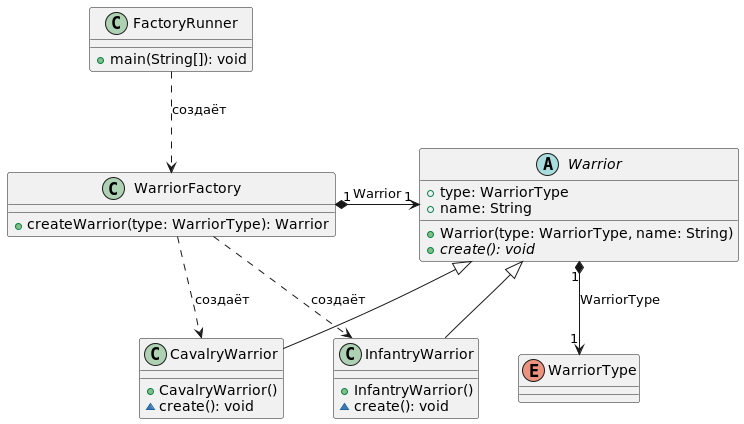

#  Паттерн фабрика (Factory Method)
Фабричный метод ‒ порождающий шаблон проектирования, предоставляющий дочерним классам интерфейс для создания экземпляров некоторого класса. Шаблон проектирования фабричный метод решает проблему создания различных групп продуктов, каждая из которых обладает некоторой спецификой.

Используется, когда:
* классу заранее неизвестно, объекты каких подклассов ему нужно создавать.
* класс спроектирован так, чтобы объекты, которые он создаёт, специфицировались подклассами.
* класс делегирует свои обязанности одному из нескольких вспомогательных подклассов, и планируется локализовать знание о том, какой класс принимает эти обязанности на себя.

Приведен пример реализации с использованием параметризированного фабричного метода в классе WarriorFactory. Для создания объекта некоторого типа в него передается соответствующий идентификатор типа. Подобная реализация не приветствуется в ООП, т.к. нарушает принципы SOLID. Подробнее это разбирается здесь http://cpp-reference.ru/patterns/creational-patterns/factory-method/ Альтернативная классическая реализация подразумевает создание группы дочерних классов (производных от WarriorFactory), каждый их которых реализует создание какого-то одного типа воина (конкретные фабрики). В итоге получится более громоздкий код, но не нарушающий концепции ООП, не использующий конструкцию switch-case (отнесем такой вариант к TODO).