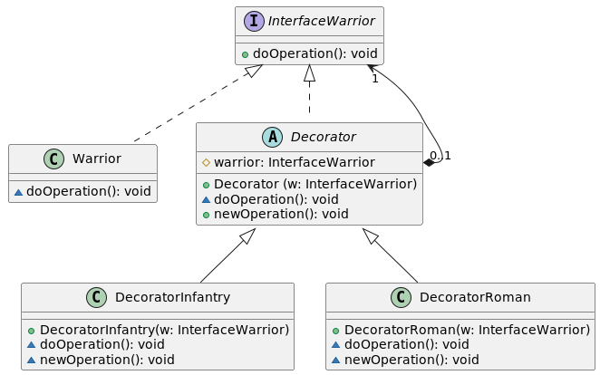

#  Паттерн декоратор (Decorator)
Декоратор ‒ структурный шаблон проектирования, предназначенный для динамического подключения дополнительного поведения к объекту. Шаблон Декоратор предоставляет гибкую альтернативу практике создания подклассов с целью расширения функциональности.

Объект, который предполагается использовать, выполняет основные функции. Однако может потребоваться добавить к нему некоторую дополнительную функциональность, которая будет выполняться до, после или даже вместо основной функциональности объекта.

Создаётся абстрактный класс, представляющий как исходный класс, так и новые, добавляемые в класс функции. В классах-декораторах новые функции вызываются в требуемой последовательности ‒ до или после вызова последующего объекта. При желании остаётся возможность использовать исходный класс (без расширения функциональности), если на его объект сохранилась ссылка. 

